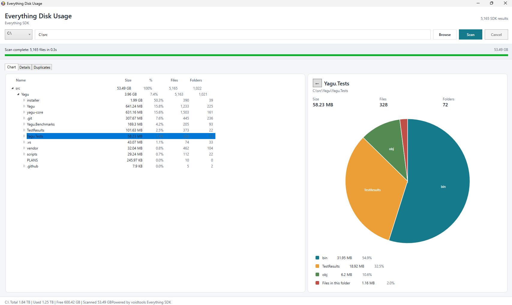

# Everything Disk Usage

Everything Disk Usage is a Windows desktop disk-usage viewer powered by the voidtools Everything index. It asks Everything for indexed file paths and file-size metadata, then builds an interactive folder-size tree, pie chart, file list, and duplicate-file view without walking the disk from scratch.



## Download

The latest rebuilt installer checked into this repository is:

[Download EverythingDiskUsage-Setup-1.0.0.exe](downloads/EverythingDiskUsage-Setup-1.0.0.exe)

The installer is self-contained, so it includes the .NET runtime files needed by the app. You still need Everything Search installed, running, and fully indexed.

## Requirements

- Windows 10/11 x64
- Everything Search installed from [voidtools](https://www.voidtools.com/downloads/)
- Everything Search running in the background with its database loaded
- .NET 10 SDK only if you want to build from source
- Inno Setup 6 only if you want to rebuild the installer locally

Install Inno Setup machine-wide with:

```powershell
winget install JRSoftware.InnoSetup --scope machine
```

## Install

1. Download [EverythingDiskUsage-Setup-1.0.0.exe](downloads/EverythingDiskUsage-Setup-1.0.0.exe).
2. Run the installer.
3. If the installer warns that Everything Search is missing, install Everything Search before using the app.
4. Launch **Everything Disk Usage** from the Start menu or the optional desktop shortcut.

The installer uses a per-user install location under `%LOCALAPPDATA%\Programs\EverythingDiskUsage`, so it does not require administrator elevation.

## How To Use

### Start A Scan

1. Make sure Everything Search is open and finished indexing.
2. Choose a drive from the drive selector, or type/paste a folder path into the path box.
3. Click **Scan**.
4. Watch the progress bar and status text while the Everything SDK query runs.
5. Click **Cancel** if you need to stop an active scan.

The app relies on Everything's existing index, so scans are usually much faster than tools that enumerate the filesystem directly. If Everything is still indexing, missing, or not running, the scan can fail or return incomplete data.

### Chart Tab

The **Chart** tab is the main exploration view.

- The left pane shows a folder tree ordered by size.
- The right pane shows the selected folder as a pie chart.
- Click a folder in the tree to update the chart.
- Click a pie slice for a subfolder to drill into that folder.
- Use the back button above the chart to return to the parent folder.
- The legend shows each visible slice with size and percent values.
- Very small or lower-ranked items are grouped into **Other** so the chart stays readable.

The selected folder summary shows total size, file count, and folder count. Direct files in the selected folder appear as **Files in this folder** in the chart.

### Details Tab

The **Details** tab gives a table-oriented view of the same scan.

- The folder grid lists every scanned folder with path, size, file count, folder count, percent of parent, last modified, and last accessed values.
- Selecting a folder updates the file grid to show files inside that folder scope.
- File rows are grouped by file name so repeated names are easy to compare.
- Groups with multiple files expand into individual file rows with their actual directories.
- The file grid caps visible rows to keep the UI responsive on very large scans.

Use this tab when you need exact paths, file counts, timestamps, or a sortable table instead of a chart.

### Duplicates Tab

The **Duplicates** tab groups files that have the same file name and the same size.

- A group row shows the duplicate name, copy count, per-file size, and estimated wasted space.
- Child rows show each matching file location.
- Zero-byte files are ignored for duplicate grouping.
- The view shows the top duplicate groups by wasted bytes.

Duplicate detection is intentionally conservative: it does not hash file contents. Treat the list as a fast lead generator, then verify files before deleting anything important.

### Shell Menu Actions

You can right-click folder and file rows to open the normal Windows shell menu for that item.

- Right-click folders in the tree or Details folder grid.
- Right-click files in the Details file grid or Duplicates grid.
- Delete actions refresh the current scan model after Windows removes the file or folder.
- Rename actions update the scan model so paths stay consistent.

If a file or folder no longer exists, the app refreshes the current view from the scan's remaining file list.

### Settings Tab

Open the **Settings** tab to adjust logging behavior.

- **Log level** controls how verbose the app log is.
- **Log every SDK file result** records every accepted file path from the Everything SDK.
- **Write logs to debug output** mirrors log lines to debug listeners.
- **Retained log files** controls how many historical log files are kept.

Settings are saved to:

```text
%LOCALAPPDATA%\EverythingDiskUsage\settings.json
```

The Settings tab also shows the settings file path, log folder path, and current log file path.

## Troubleshooting

### Scan Fails Immediately

Check that Everything Search is installed, running, and indexed. Open Everything Search directly and wait for indexing to finish, then scan again.

### Results Look Incomplete

Everything Disk Usage can only report what Everything has indexed. Confirm that Everything is allowed to index the drive or folder you are scanning.

### Installer Warns About Everything Search

The app can still install, but it will not be useful until Everything Search is installed and running. The installer can open the Everything download page for you.

### Logs

The app writes logs to:

```text
%LOCALAPPDATA%\EverythingDiskUsage\logs\
```

Each run creates a timestamped `EverythingDiskUsage-*.log` file. Logs include startup/shutdown, UI operations, scan progress, folder/file detail population, Everything SDK query setup, SDK result processing, errors, and cleanup.

Set `EVERYTHING_DISK_USAGE_LOG_EACH_FILE=1` before launching the app to log every accepted SDK file result. Without that switch, the scanner logs the first few files and periodic progress samples to avoid generating very large logs on full-drive scans.

## Run From Source

```powershell
cd D:\EverythingDiskUsage
dotnet run --project .\EverythingDiskUsage.csproj
```

Everything Search must still be installed, running, and indexed. The app includes `Everything64.dll` in the repository and copies it beside the executable during build.

## Build

Build a Debug binary:

```powershell
cd D:\EverythingDiskUsage
dotnet build .\EverythingDiskUsage.csproj -c Debug
```

Build a Release binary:

```powershell
dotnet build .\EverythingDiskUsage.csproj -c Release
```

The normal build output is written under:

```text
bin\<Configuration>\net10.0-windows\
```

## Rebuild The Installer

Create a self-contained Windows x64 publish output and rebuild the Inno Setup installer:

```powershell
dotnet publish .\EverythingDiskUsage.csproj -c Release -r win-x64 --self-contained -o .\artifacts\publish
```

If Inno Setup 6 is installed machine-wide, `dotnet publish` builds the installer automatically at:

```text
installer-output\EverythingDiskUsage-Setup-1.0.0.exe
```

Copy the rebuilt installer into `downloads\` when you want the repository link to point at the newest checked-in installer:

```powershell
Copy-Item .\installer-output\EverythingDiskUsage-Setup-1.0.0.exe .\downloads\EverythingDiskUsage-Setup-1.0.0.exe -Force
```

If `ISCC.exe` is installed somewhere non-standard, pass its path explicitly:

```powershell
dotnet publish .\EverythingDiskUsage.csproj -c Release -r win-x64 --self-contained -o .\artifacts\publish /p:IsccPath="C:\Path\To\ISCC.exe"
```

## Tests

Run the automated test suite with:

```powershell
dotnet test .\EverythingDiskUsage.slnx --configuration Debug
```

Run tests with coverage collection:

```powershell
dotnet test .\EverythingDiskUsage.slnx --configuration Debug --collect:"XPlat Code Coverage" --results-directory .\TestResults
```

## Release To Download Site

The Azure publishing script builds the app, creates the release ZIP, uploads it to the private downloads container, and updates the Everything Disk Usage card on the static download site:

```powershell
.\scripts\publish-to-azure.ps1 -Configuration Release
```

This requires Azure CLI access to the `installmonitordl` storage account in the `rg-installmonitor-download` resource group.

## License

Everything Disk Usage is released under the 0BSD license. See `LICENSE`.